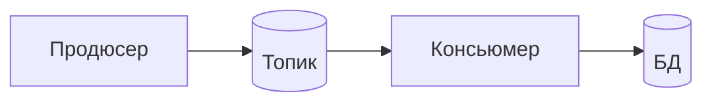

---
{"dg-publish":true,"permalink":"/prompts/razbor-tehsobesa-aqa-ed-aj-ti-sla-monitoring/","dg-note-properties":{}}
---

# Разбор технического этапа — AQA, «Эд-АйТи» (система SLA-мониторинга, встреча с разработчиком)

Разбор встречи от **24 сентября, 12:31–13:47**. Первый технический этап в «Эд-АйТи». С их стороны:

- **Никита** — бэкенд-разработчик, не тестировщик. Проводил встречу один
- **Менеджер** (обычно ведёт «вводную» часть и рассказывает о компании) — на больничном, отсутствовал
- **Вера** — HR, была на предыдущем этапе, даст обратную связь

Рамка сложилась сама: *«Меня никто не предупредил, что будет сегодня собеседование. Человек, который должен был это сделать, на больничный ушёл»*. То есть интервьюер **не готовился**, вопросы шли по его личному списку — «я этот вопрос задаю всем», «задаю такие вопросы, которые тестировщик не должен знать».

Фактически это **проверка общего технического кругозора глазами разработчика**: HTTP, CI, параллельность, Kafka, SQL, Docker, Git, Linux, безопасность. Тестирование как дисциплину (тест-дизайн, стратегия, фреймворк) почти не спрашивали — это важно для оценки: провалы пришлись на смежные области, а не на ядро профессии.

Структура:

1. **Рассказ о себе** — «две компании, какие задачи, какой-нибудь крутой тест»
2. **Короткий блок про API** — контрактное тестирование, UI или API
3. **Рассказ Никиты о компании** — продукт, команды, железо, офис, вилка
4. **Технический блиц** — Postman и методы, статус-коды, CI, параллельность, Kafka, SQL, Docker, Git, Linux, OWASP, CSRF
5. **Вопросы кандидата** — тестирование в компании, роль, UML, API, сроки
6. **Внеплановая часть** — демонстрация своих AI-оркестраторов и VPN-утилиты
7. **Финал** — обратная связь в понедельник, следующий этап — гендиректор

Формат как в разборе R-Vision: **вопрос → что ответил → оценка → идеальный ответ → 🔧 инженерная расшивка**. В конце — контекст вакансии, риски роли, чек-лист к встрече с гендиректором, скоринг и приложения-шпаргалки.

---

## Содержание

**Блок I. Самопрезентация**
1. Рассказ о Т-Банке: сильный материал, но без структуры
2. «Крутой тест» — вопрос, на который так и не ответил

**Блок II. API и инструменты**
3. Контрактное тестирование: «через OT», Pydantic, WireMock, Pact
4. «Что интереснее — UI или API?»
5. Postman и HTTP-методы — ⚠️ OPTIONS
6. ⚠️ Статус-коды 4xx: 401, 409, 422 — где ошибки

**Блок III. CI и изоляция тестов**
7. «Локально зелёные, в CI красные» — ответ без алгоритма
8. Параллельный прогон и shared state — ответ длинный, но верный по сути

**Блок IV. Kafka**
9. ⚠️ Продюсер → Kafka → консьюмер → БД: ответил на другой вопрос
10. Устройство Kafka — сильный ответ

**Блок V. SQL**
11. Самооценка, JOIN, CTE и временная таблица
12. Подзапрос быстрее JOIN — EXISTS
13. ⚠️ Транзакция: «наверное, нет» — самый дорогой ответ встречи
14. Нормализация и индексы

**Блок VI. Docker, Git, Linux**
15. Docker и Kubernetes
16. cherry-pick и stash
17. ⚠️ SSH: «сертификат 254» — и поиск по логу

**Блок VII. Безопасность**
18. OWASP Top 10 — «мем из IT»
19. ⚠️ CSRF — перепутан с CORS

**Блок VIII. Вопросы кандидата и внеплановая часть**
20. Что выяснилось о роли — и какие вопросы не заданы
21. ⚠️ Демонстрация VPN-утилиты «чтобы не заблокировал Claude»
22. Нейросети и «недетерминированные системы» — монолог на две минуты
23. Вилка: «200 — это же ваш максимум»
24. Финал и сроки

**Контекст вакансии и риски роли**
**Чек-лист: подготовка к встрече с гендиректором**
**Скоринг**

**Приложения**
1. Шпаргалка HTTP: методы и статус-коды
2. SQL-минимум для AQA: транзакции, ACID, изоляция, индексы, нормализация
3. Linux-минимум: SSH, логи, scp
4. Тестирование связки Kafka по уровням
5. Безопасность для тестировщика: OWASP Top 10, CSRF, CORS
6. UML для тестировщика — под их продукт
7. План «один автоматизатор с нуля» — 30/60/90 дней
8. Как отвечать, когда не знаешь

---

## Общий вердикт по встрече

Одной фразой: **встреча прошла тепло и, скорее всего, успешно — интервьюер прямо сказал «я бы хотел, чтобы тебя на следующий этап пригласили», — но по технике всплыли пробелы в базе (транзакции, коды 4xx, CSRF, SSH-ключи), а на центральный вопрос про Kafka кандидат ответил не на тот вопрос.**

### Что сыграло в плюс

**Реальный опыт построения автоматизации с нуля.** Т-Бизнес, отказ от легаси на Selenide с покрытием 10–15%, выбор Playwright + TypeScript, код-стайл, приоритет селекторов (`getByRole` первым), API-фикстуры вместо UI-подготовки данных. Для «Эд-АйТи», где тестирования **нет вообще** и нужен человек, который всё поставит с нуля, это ровно тот профиль.

**Домен со сложными состояниями.** «ФНС-ограничения, БКИ, скоринг меняют ожидаемое поведение — структура теста с глубокой параметризацией». Это прямой мост к их продукту, где один код собирается в разные системы через конфигурацию.

**Kafka на уровне выше среднего.** Топики, брокеры, лидер и реплики, группы консьюмеров, офсеты — рассказано уверенно и без подсказок. Никита: *«Окей, понял, круто»*.

**Самостоятельно поправил себя.** «Кстати, наврал. 409 — конфликт». «Разлогин — плохой пример». Самокоррекция на интервью — плюс: видно, что человек думает, а не зачитывает.

**Работа с нейросетями.** Для этой команды это оказалось сильным козырем: *«у нас человека три или четыре бились бы тут в экстазе»*, *«один из тимлидов как раз спрашивает про эту тему»*. Попадание в культуру команды.

**Вопросы по делу.** Один ли автоматизатор, ожидания по покрытию, пропорция UI/API, описаны ли API, сроки и этапы. Из ответов собрана почти полная картина роли.

### Что было слабее

⚠️ **Транзакция.** «Там может быть несколько операций?» — «Наверное, нет». Это базовое понятие, которое тестировщик банковского продукта обязан знать. Никита ответил сам. Разбор — глава 13.

⚠️ **Статус-коды.** 401 произнесён неразборчиво, 409 назван как Too Many Requests, потом 422 — тоже Too Many Requests. Верно: 409 Conflict, 422 Unprocessable Entity, 429 Too Many Requests. Разбор — глава 6.

⚠️ **Kafka — не тот ответ.** Вопрос: *«как будешь тестировать каждый уровень взаимодействия: продюсер, Kafka, консьюмер, БД»*. Ответ: как на прошлом проекте искали сообщение в топике по UID. Проверку консьюмера и записи в БД не назвал, негативные сценарии (дубли, порядок, битое сообщение) — тоже. Затем ушёл в устройство Kafka — это хорошо, но это другой вопрос. Разбор — глава 9.

⚠️ **CSRF перепутан с CORS**, а SSH-ключ назван «сертификатом 254/258 формата». Для роли, где **логи читают по SSH и grep’ом** (это прямо сказано), SSH — не теория. Разбор — главы 17, 19.

**Нет алгоритма в ответе про CI.** «Версии разные, dependencies, сеть» — гипотезы без порядка действий. Не прозвучали: смотреть лог джобы, артефакты и трейс, воспроизвести в том же Docker-образе. Разбор — глава 7.

**OWASP — «мем из IT».** Для компании, чьи заказчики — ФНС, Минобороны, Росгвардия, это не лучший образ. Разбор — глава 18.

⚠️ **Демонстрация VPN-утилиты для обхода блокировок.** Экран с инструментом, который «прокидывает VLESS в SOCKS5», чтобы «Claude не заблокировал за российский IP», показан сотруднику **подрядчика госструктур**. Никите понравилось, но гендиректор или служба безопасности могут отнестись иначе. Разбор — глава 21.

**Длинные ответы и жаргон.** «Вымеряли площадь покрытия», «саб-лидерские моменты», «ответственность самостоятельность в обозначении критикал пути» — та же проблема, что в R-Vision: абстракции без картинки. Здесь интервьюер не одёргивал, но это видно по расшифровке.

### Диагноз

Две разные проблемы:

1. **Пробелы в смежной базе** — SQL-транзакции, HTTP-коды, SSH, веб-безопасность. Это **не ядро AQA**, и Никита сам это сказал: *«задаю такие вопросы, которые тестировщик не должен знать… мне интересен общий уровень»*. Но именно на эти вопросы опирается впечатление разработчика об «общем уровне». Лечится за 2–3 вечера — Приложения 1–3, 5.
2. **Ответ не на тот вопрос** — Kafka, «крутой тест», CI. Кандидат рассказывает то, что знает, вместо того, что спросили. Лечится правилом: *первое предложение ответа — прямой ответ на вопрос, потом детали.*

### Итог

Оценка технического этапа: **~3.4 из 5**. Шансы пройти на встречу с гендиректором — **75–85%**.

За: интервьюер вслух сказал, что хочет пригласить дальше; профиль «строил автоматизацию с нуля» совпадает с задачей «тестирования нет, наладь всё»; попадание в культуру через нейросети; вилка совпала; офис/гибрид принят; компания ищет два месяца, один кандидат уже сорвался — им нужен человек.

Против: базовые пробелы в SQL и HTTP; Kafka не по вопросу; риск восприятия VPN-истории на уровне гендиректора и СБ; оценка шла от разработчика, который сам не тестировщик и может оценивать «общую эрудицию» строже, чем профильную экспертизу.

---

# БЛОК I. САМОПРЕЗЕНТАЦИЯ

Никита задал рамку: *«Расскажи про свои две компании, чем там занимался, какие задачи исполнял, может, вспомнишь один из тестов, крутой, который ты написал. Может, какая-нибудь крутая связка была. Не однотипное»*.

В вопросе **три части**: две компании, задачи, **один конкретный крутой тест**. Третья — главная: интервьюер-разработчик хочет увидеть инженерную задачу, а не биографию.

---

## Глава 1. Рассказ о Т-Банке: сильный материал, но без структуры

**Что ответил** (в сокращении, формулировки сохранены):

> «Работаю в Т-Банке более двух лет. Начинал с физиков — юниты личного кабинета клиентов, там было напополам ручное и авто, много исследовательского. Последние 8 месяцев — Т-Бизнес: Т-Мани, посткредитование, рассрочка. Особенности домена — разные точки входа, бизнес-роли, статусы клиента, кросс-авторизация.
>
> Занимались построением архитектуры с нуля. Было немного кода на Selenide, отказались — покрытие смешное, 10–15%. Начали на Playwright, "понятно, наверное, почему", язык TypeScript. Первым делом разработали код-стайл, этим в основном занимался я: Page Object Model, как размещаем компоненты, приоритет селекторов — getByRole первым, потом CSS, XPath, скопинг по родителям.
>
> Проект: UI-фикстуры, когда не удавалось получить API-фикстуры, преимущественно API-фикстуры. Микросервисы, Kafka, OTP-модуль, ФНС-модуль — ФНС создаёт блокеры на статусы, меняет ожидаемое поведение. С таким ограничением ждём такого результата, с таким БКИ и скорингом — такого. Структура теста с глубокой параметризацией.
>
> Команда — три человека, выделенная QA-группа, не продуктовая. Кросс-ревью, база знаний на Confluence как стандарт. Со второго месяца вымеряли площадь покрытия там, где горят хотфиксы. Модалки часто ломались — выделили их в отдельный модуль».

**Оценка:**
- 👍 **Содержание сильное и релевантное.** Автоматизация с нуля, отказ от легаси с цифрой (10–15%), выбор стека, код-стайл как личная инициатива, API-фикстуры для подготовки данных. Всё, что нужно компании, где тестирования нет.
- 👍 **Домен со сложными состояниями назван конкретно**: ФНС-блокеры, БКИ, скоринг, параметризация. Это сильнее, чем «работал с микросервисами».
- 👍 **Первая компания проговорена честно**: напополам ручное, исследовательское тестирование. Не приукрашено.
- 👎 **«Понятно, наверное, почему такое решение было выбрано».** Интервьюер — бэкенд-разработчик, он не обязан знать, почему Playwright. Позже он сам сказал: *«я с ним не работал, но знаю, что он быстрее Selenium»*. Аргумент был нужен.
- 👎 **Спрашивали про две компании — рассказ только про одну.** Т-Банк — одна компания с двумя этапами (физлица → Т-Бизнес). Если в резюме есть вторая, её не прозвучало вообще. Если нет — надо было сказать «у меня фактически одно место, но два разных проекта».
- 👎 **Ни одной цифры результата.** Сколько тестов, какое покрытие после, сколько идёт прогон, сколько багов поймали до прода. «Покрытие было 10–15%» есть — а «стало N» нет.
- 👎 **Шесть минут монолога**, повторы («личного кабинета, личного кабинета»), жаргон («вымеряли площадь», «юниты горят»).

**Идеальный ответ** — за три минуты:

> Последние два с лишним года — Т-Банк. Первый год — личный кабинет физлиц, там было примерно пополам ручного и автоматизации, много исследовательского тестирования.
>
> Последние восемь месяцев — Т-Бизнес: Т-Мани, посткредитование, рассрочки. Пришли на проект, где автотестов почти не было — немного Selenide, покрывавшего 10–15%. Мы его вывели и начали с нуля на Playwright и TypeScript: он из коробки даёт автоожидания, трейсы и параллельный прогон, не надо строить это самим.
>
> Команда — три автоматизатора. Первое, что я сделал, — код-стайл: как пишем Page Object, какие селекторы в каком приоритете, что выносим в компоненты. Через месяц по нему уже шло кросс-ревью.
>
> Данные для тестов готовим через API, а не через интерфейс — так тест в 5–10 раз быстрее и не падает из-за чужих экранов.
>
> Итог: за восемь месяцев — **N сценариев** в ежедневном прогоне, критичный путь покрыт на **X%**, прогон идёт **Y минут**.
>
> И сразу про «крутой тест», вы спрашивали — расскажу один.

---

## Глава 2. «Крутой тест» — вопрос, на который так и не ответил

**Что произошло.** Посреди рассказа кандидат сам вспомнил: *«Ты просил рассказать именно какие-то сложные кейсы, да? Ну да, я, конечно, вспомню»* — и вернулся к хронологии команды. Конкретного теста не прозвучало. Никита переключился на API.

**Оценка:**
- 👎 **Упущена самая выгодная часть вопроса.** «Крутой тест» — это приглашение показать инженерное мышление на одном примере. Такие вопросы запоминаются лучше всего остального.
- 👎 **Материал для ответа был прямо в рассказе**: ФНС-блокеры меняют поведение интерфейса, скоринг влияет на виджеты, Kafka подтверждает бэкенд-событие. Надо было собрать это в один сценарий.

**Идеальный ответ** — одна история по схеме «задача → сложность → решение → результат»:

> Самый интересный — параметризованный тест на ограничения ФНС.
>
> **Задача:** у бизнес-клиента может стоять блокировка от налоговой, и в зависимости от её типа, скоринга и статуса по-разному ведёт себя кабинет: какие-то операции скрыты, какие-то показывают модалку, какие-то работают.
>
> **Сложность:** комбинаций десятки, а готовить клиента в нужном состоянии через интерфейс невозможно — это делается во внешних системах.
>
> **Решение:** клиента в нужном статусе создаём через API-фикстуру, блокировку ставим через тестовую ручку ФНС-модуля. Сам тест — одна функция, параметры — таблица «тип ограничения × скоринг → ожидаемое поведение». Дополнительно проверяем, что в Kafka ушло событие о блокировке — то есть проверяем не только экран, но и то, что бэкенд действительно отработал.
>
> **Результат:** вместо двадцати почти одинаковых тестов — один на ~30 комбинаций; новое ограничение добавляется одной строкой в таблицу. И именно он поймал баг, когда после релиза модалка перестала показываться для одного из типов блокировки.

**Почему это работает на разработчика:** он слышит знакомые инженерные вещи — параметризацию, подготовку состояния через API, проверку асинхронного события. И видит, что тестировщик думает о **поддерживаемости**, а не только о количестве тестов.

---

# БЛОК II. API И ИНСТРУМЕНТЫ

---

## Глава 3. Контрактное тестирование: «через OT», Pydantic, WireMock, Pact

**Вопрос:** *«А вообще есть понимание, как тестировать API?»*

**Что ответил:**

> «Контрактное тестирование на клиентском слое у нас реализовано. На TypeScript валидация происходит через OT. На Python на клиентской части — через Pydantic. Знаю, как работать с WireMock’ами. Более продвинутые — Pact».

**Оценка:**
- 👍 **Названы правильные инструменты**: Pydantic для валидации схем на Python, WireMock для заглушек, Pact для контрактов.
- 👎 **«Через OT»** — в расшифровке так, вероятно, имелся в виду **Zod** или **AJV**. Если сказано невнятно, интервьюер услышал непонятное слово. Название библиотеки надо произносить чётко.
- 👎 **Валидация схемы ответа ≠ контрактное тестирование.** Это та же ошибка, что уже разбиралась в R-Vision (Пробел 3). Контрактное тестирование — когда потребитель и поставщик договариваются о контракте и проверяют **обе стороны** (Pact). Проверка ответа по схеме на стороне клиента — это **валидация схемы**.
- 👎 **Вопрос «как тестировать API» остался без ответа по существу.** Не прозвучало ни одного слова про то, *что* проверяется: статус-коды, тело, схема, негативные сценарии, авторизация, идемпотентность.

**Идеальный ответ:**

> Да, API тестировал много — на Т-Бизнесе через API мы и данные готовили, и проверяли бэкенд.
>
> Что проверяю в каждой ручке: статус-код, схему ответа — у нас это Zod на TypeScript, на Python Pydantic, — и бизнес-значения в теле. Потом негативные сценарии: без токена, с чужим токеном, с невалидными полями, с граничными значениями, повторный запрос — не создаётся ли дубль.
>
> Честно про контракты: у нас это **валидация схем** на стороне клиента. Полноценного контрактного тестирования через Pact, когда проверяются обе стороны, я не внедрял — но понимаю, как оно устроено, и знаю WireMock для заглушек зависимостей.

---

## Глава 4. «Что интереснее — UI или API?»

**Что ответил:**

> «Нет такого вопроса, что интереснее. Бывают задачи муторные и сложные с UI, есть, которые приводят к росту — необычный скоупинг по элементам HTML-страницы. Есть задачи с API — рутинные и скучные. Где-то можно очень быстро API покрыть. С агентами API, наверное, покрывать легче».

И тут же — встречный вопрос про отношение компании к AI-агентам.

**Оценка:**
- 👍 **Честно и без позы «мне всё нравится».**
- 👎 **«API — рутинные и скучные».** Позже выяснилось, что у них **70% тестов планируется на API**. Сказать будущему работодателю, что основная часть работы скучная, — неудачно, даже если не знал заранее.
- 👎 **Смена темы на AI-агентов посреди ответа.** Вопрос правильный, но его место — в конце, в блоке вопросов кандидата.

**Идеальный ответ:**

> Мне ближе всего подход, при котором главное — API: тесты там быстрее, стабильнее и ловят баги ближе к причине. UI оставляю для сквозных сценариев, которые реально проходит пользователь.
>
> А по интересу — сложные задачи есть и там и там. В UI это нестабильная вёрстка и хитрые компоненты, в API — асинхронные цепочки, когда результат появляется не в ответе, а через Kafka или в базе.

---

## Глава 5. Postman и HTTP-методы — ⚠️ OPTIONS

**Вопросы:** работал ли с коллекциями и скриптами Postman; какие есть методы; что такое OPTIONS и когда используется.

**Что ответил:**

> «Коллекциями работал, `pm.` и команды — это JavaScript. Редко прибегаю, проще написать простые автотесты на Playwright. Postman чаще — повторить запрос, Copy as cURL, отправить разработчику».
>
> «Методы — CRUD… POST, PUT, PATCH, DELETE, Header… OPTIONS».
>
> «OPTIONS — это для работы с метаданными, используем редко… метаданные — это по сути хедеры… CORS-политика».

Никита: *«На моей практике OPTIONS чаще всего применялись, когда мы сталкиваемся с CORS»*.

**Оценка:**
- 👍 **Честное позиционирование Postman** как инструмента ручной проверки и воспроизведения, cURL разработчику — правильная практика.
- 👎 **GET не назван.** Самый частый метод выпал из перечисления.
- 👎 **«Header» назван методом.** Такого метода нет — есть **HEAD**. Скорее оговорка, но на слух это ошибка.
- 👎 **OPTIONS объяснён через «метаданные = хедеры».** Правильный ответ — **preflight-запрос CORS**: браузер перед «непростым» кросс-доменным запросом спрашивает сервер, какие методы и заголовки разрешены. CORS прозвучал, но в конце и вскользь — Никита ответил за кандидата.

**Идеальный ответ:**

> Основные: **GET** — получить, **POST** — создать, **PUT** — заменить целиком, **PATCH** — изменить частично, **DELETE** — удалить. Плюс **HEAD** — как GET, но только заголовки, и **OPTIONS**.
>
> OPTIONS на практике — это **preflight CORS**. Когда фронт с одного домена делает, например, PUT с JSON на API другого домена, браузер сначала сам отправляет OPTIONS и спрашивает, разрешено ли это. Сервер отвечает заголовками `Access-Control-Allow-Origin`, `-Methods`, `-Headers`. Если ответ не тот — запрос падает в браузере с ошибкой CORS, хотя из Postman он проходит. Как тестировщик я с этим сталкиваюсь именно так: «в Postman работает, в браузере нет» — первым делом смотрю preflight во вкладке Network.

**Бонус, который стоит знать:** идемпотентность. GET, PUT, DELETE — идемпотентны (повтор даёт тот же результат), POST — нет. Это частый добивочный вопрос.

---

## Глава 6. ⚠️ Статус-коды 4xx: 401, 409, 422 — где ошибки

**Что ответил:**

| Код | Ответ кандидата | Правильно |
|---|---|---|
| 400 | Bad Request | ✅ |
| 401 | неразборчиво («она втораяся») | **Unauthorized** — не аутентифицирован: нет токена или он невалиден |
| 403 | Forbidden | ✅ — аутентифицирован, но нет прав |
| 404 | Not Found | ✅ |
| 409 | Too Many Requests → поправил на Conflict | **Conflict** — конфликт с текущим состоянием ресурса ✅ после исправления |
| 422 | «скорее всего Too Many Requests» | ❌ **Unprocessable Entity** — синтаксис верный, но данные не проходят валидацию |
| — | — | **429 Too Many Requests** — превышен лимит запросов |

**Оценка:**
- 👍 **Самоисправление по 409** — хорошо, и объяснение конфликта состояния верное.
- 👎 **422 и 429 перепутаны.** Too Many Requests — это 429, его легко запомнить: «4-2-9 — слишком много».
- 👎 **401 прозвучал невнятно.** Если слово не выговаривается чётко, интервьюер записывает «не знает».
- 👎 **Разница 401 и 403 не проговорена** — а это классический добивочный вопрос.

**Идеальный ответ** — коротко, как просили:

> 400 — некорректный запрос, например битый JSON.
> 401 — не авторизован: нет токена или он протух.
> 403 — токен есть, но прав нет.
> 404 — ресурс не найден.
> 409 — конфликт состояния: например, создаём пользователя с уже занятым логином.
> 422 — запрос синтаксически правильный, но данные не проходят бизнес-валидацию: дата окончания раньше даты начала.
> 429 — превышен лимит запросов.

---

# БЛОК III. CI И ИЗОЛЯЦИЯ ТЕСТОВ

---

## Глава 7. «Локально зелёные, в CI красные» — ответ без алгоритма

**Вопрос:** *«Локально тесты проходят, в CI упали. Что будешь делать, как искать проблему?»*

**Что ответил:**

> «Первое — версии проекта разные могут быть, другие dependencies в CI. Второе — наборы не те: у тебя старая версия, а другой автотестер уже что-то запушил. Сетевые моменты — джоба запускается с сервера GitLab».

**Оценка:**
- 👍 **Гипотезы правильные**: зависимости, расхождение веток, сеть.
- 👎 **Вопрос был «как будешь искать», а прозвучало «что может быть».** Нет ни одного действия: куда смотреть, в каком порядке.
- 👎 **Не названы самые частые причины**: другое окружение и стенд, переменные окружения и секреты, headless-режим и разрешение экрана, параллельность в CI (локально тесты шли по одному), тайминги на слабой машине раннера, тестовые данные.
- 👎 **Не названы артефакты**, хотя с Playwright это главный инструмент: трейс, скриншот, видео.

**Идеальный ответ:**

> Иду от фактов, а не от гипотез.
>
> 1. **Лог джобы**: на каком шаге упало — установка, сборка, сами тесты. Если все тесты упали одинаково — проблема в окружении, если один-два — в тестах или данных.
> 2. **Артефакты**: в Playwright это трейс, скриншот, видео. По трейсу видно, что было на странице и какой запрос вернул ошибку.
> 3. **Сравниваю окружение**: версии зависимостей (lock-файл закоммичен?), версию Node и браузеров, переменные окружения и секреты, адрес стенда.
> 4. **Проверяю отличия режима**: в CI обычно headless, другое разрешение, больше воркеров. Частая причина — тесты мешают друг другу при параллельном прогоне, а локально я гонял по одному.
> 5. **Воспроизвожу**: запускаю локально в том же Docker-образе, что и CI, с тем же числом воркеров.
>
> Если падение плавающее — смотрю историю прогонов: падает всегда или через раз. Через раз — почти всегда тайминги или общие данные.

---

## Глава 8. Параллельный прогон и shared state — ответ длинный, но верный по сути

**Вопрос:** *«Запускаешь много тестов параллельно в CI. Как гарантировать, что они не перетрут друг друга?»*

**Что ответил** (две минуты, в сокращении):

> «Проблема shared state. Фикстуры: жизненный цикл — setup, тело, teardown, в Python через yield. Кастомные фикстуры в Playwright, чтобы не было наслоения. Микросервисы и общая БД, PostgreSQL — тесты обращаются к одним и тем же состояниям, гонка. Пример: один тест добавляет в корзину 100 товаров, другой удаляет — оба падают».

Никита: *«Этого достаточно, даже более чем достаточно»*.

**Оценка:**
- 👍 **Проблема названа правильно** — shared state, пример с корзиной понятный.
- 👍 **Интервьюер остался доволен.**
- 👎 **Проблема описана, решение — почти нет.** Прозвучало «фикстуры с teardown», но главное решение — **каждому тесту свои данные** — сказано не было.
- 👎 **Путаница**: `yield` в фикстуре не «освобождает page для переиспользования», он отделяет подготовку от очистки. Упомянуты и PostgreSQL, и MySQL в одном примере.

**Идеальный ответ:**

> Главное правило — **тесты не должны делить изменяемые данные**.
>
> 1. **Каждый тест создаёт свои данные** через API-фикстуру: своего пользователя, свою корзину. Уникальность — через суффикс, например UUID в имени.
> 2. **Фикстура убирает за собой** в teardown — удаляет созданное.
> 3. **Общие только данные для чтения**: справочники, которые тесты не меняют.
> 4. **Если общий ресурс неизбежен** (одна настройка системы на весь стенд) — такие тесты помечаю и запускаю последовательно, отдельной группой.
> 5. В Playwright каждый тест и так получает свой браузерный контекст — куки и localStorage не пересекаются. Проблема почти всегда на бэкенде, в данных.

---

# БЛОК IV. KAFKA

---

## Глава 9. ⚠️ Продюсер → Kafka → консьюмер → БД: ответил на другой вопрос

**Вопрос:** *«Есть продюсер, пушит сообщение в Kafka, консьюмер забирает и записывает в БД. Расскажи, как будешь тестировать каждый уровень взаимодействия»*.

**Что ответил:**

> «Важный вопрос — какой уровень мы тестируем. Чаще всего на своём проекте тестируем сообщения от топиков. Микросервис написал в топик, что действие совершено. У сообщения уникальный идентификатор, на него подвязываемся. И понимаем, что не только кнопка нажалась, но и сущность на бэкенде отработала. Тестирование по UID».

**Оценка:**
- 👍 **Поиск сообщения по уникальному идентификатору** — правильная техника.
- 👎 **Ответ про одну точку, а спрашивали про три уровня.** Продюсер — да, частично. **Консьюмер и запись в БД не прозвучали вообще.** А именно БД — финальная точка, ради которой вся связка.
- 👎 **Нет негативных сценариев**, а в Kafka они самые интересные: невалидное сообщение, дубль, порядок, консьюмер упал и перечитал.
- 👎 **Для их продукта это важно.** Зонды собирают трафик → данные идут по конвейеру → пишутся в хранилище → показываются в мониторинге. Даже если у них не Kafka, логика «источник → очередь → обработчик → база» — это ровно их система.

**Идеальный ответ:**

> Разбиваю по уровням и на каждом проверяю своё.
>
> **1. Продюсер.** Вызываю действие, которое публикует сообщение, и читаю топик тестовым консьюмером по ключу или ID. Проверяю: сообщение появилось, схема правильная, ключ правильный (от него зависит партиция и порядок), значения полей совпадают с входными.
>
> **2. Консьюмер изолированно.** Сам кладу сообщение в топик — без продюсера — и смотрю, что консьюмер его обработал. Здесь же негатив:
> - битое сообщение — консьюмер не падает, сообщение уходит в DLQ или в лог ошибок;
> - **дубль** того же сообщения — в базе не появляется вторая запись (идемпотентность);
> - сообщения не по порядку — итоговое состояние всё равно правильное.
>
> **3. База.** После обработки проверяю запись в БД — **с ожиданием через поллинг**, а не через `sleep`: обработка асинхронная. Проверяю поля, связи, отсутствие дублей.
>
> **4. Сквозной сценарий.** Один-два E2E: действие → сообщение → запись в базе.
>
> **Плюс отказоустойчивость**, если есть стенд: остановить консьюмер, накидать сообщений, поднять — он дочитывает с последнего закоммиченного офсета, ничего не теряется и не дублируется.

Подробнее — Приложение 4.

---

## Глава 10. Устройство Kafka — сильный ответ

**Что ответил** (после «могу рассказать под капотом» — «ну, будет плюсик»):

> «Топик — логическая группа по смыслу, например покупки. Брокеры — единица отказоустойчивости: есть лидер, реплики его догоняют; если машина упадёт, другая станет лидером. Группа консьюмеров — единица параллелизма. У консьюмеров офсеты — закладочка. Если всё упало — читают с последнего закоммиченного офсета».

**Оценка:**
- 👍 **Лучший технический фрагмент встречи.** Уверенно, без подсказок, с правильной картинкой. Никита: *«Окей, понял, круто»*.
- 👎 **Упущены партиции** — а это центральное понятие. Лидер и реплики существуют **у партиции**, а не у топика. Единица параллелизма — **партиция**: в одной группе консьюмеров партицию читает только один консьюмер.
- 👎 **«Сколько групп консьюмеров — тем быстрее»** — неточно. Разные группы читают **одни и те же** сообщения независимо (каждая — своё приложение). Скорость растёт от **числа консьюмеров внутри группы**, но не больше, чем партиций.

**Правильная версия одной фразой:**

> Топик делится на **партиции**; у каждой партиции есть лидер на одном брокере и реплики на других. Внутри одной группы консьюмеров каждая партиция читается ровно одним консьюмером, поэтому параллелизм ограничен числом партиций. Разные группы читают топик независимо — у каждой свои офсеты.

---

# БЛОК V. SQL

---

## Глава 11. Самооценка, JOIN, CTE и временная таблица

**Что ответил:**

> «Средний уровень. Многоэтажные табличные выражения из головы не напишу, загуглю — напишу любой сложности. CTE. Джойны — inner, cross, left, right. Inner — пересечение, left — всё слева и пересечение справа».
>
> CTE против временной таблицы: «CTE записывается и переиспользуется по алиасу, аналог переменной. Временную таблицу придётся каждый раз записывать заново».

**Оценка:**
- 👍 **Честная самооценка.** «Средний уровень, загуглю» — нормально для AQA.
- 👍 **Джойны объяснены правильно.**
- 👎 **FULL JOIN не назван.**
- 👎 **CTE и временная таблица перепутаны наоборот.** Как раз **временная таблица** создаётся один раз и живёт всю сессию — её можно использовать во многих запросах. **CTE** живёт только в рамках одного запроса.

**Правильно:**

> **CTE** (`WITH ... AS`) — именованный подзапрос, существует только внутри одного запроса. Удобен для читаемости и рекурсии.
>
> **Временная таблица** (`CREATE TEMP TABLE`) — реальная таблица, живёт до конца сессии или транзакции. Её можно заполнить один раз, повесить индекс и использовать в нескольких запросах. Выгодна, когда промежуточный результат большой и нужен многократно.

---

## Глава 12. Подзапрос быстрее JOIN — EXISTS

**Вопрос:** *«Когда подзапрос будет быстрее, чем JOIN?»*

**Что ответил:** сначала переспросил, одна ли это категория, потом предположил: *«подзапрос считается однажды и берётся из памяти, а джойны высчитываются каждый раз»*.

Никита: *«Я этот вопрос задаю всем… правильный ответ в том, что человек не знает правильного ответа»* — и объяснил про **EXISTS**: подзапрос останавливается на первой найденной записи.

**Оценка:**
- 👍 **Интервьюер заранее считал вопрос «со звёздочкой»** — незнание не штрафуется.
- 👎 **Версия про «кэширование подзапроса» — выдумана на ходу.** Лучше было честно сказать «точно не знаю, предположу» и дать осторожную гипотезу. Кандидат так и сделал («я предположение»), но сама гипотеза неверная.

**Идеальный ответ:**

> Классический случай — **EXISTS**. Если нужно просто проверить, есть ли у клиента хоть один заказ, `WHERE EXISTS (SELECT 1 FROM orders WHERE ...)` остановится на первой найденной строке. JOIN вытащит все заказы и потом придётся схлопывать дубли через DISTINCT.
>
> Вообще же современные оптимизаторы часто переписывают одно в другое, поэтому точный ответ даёт только `EXPLAIN ANALYZE`.

---

## Глава 13. ⚠️ Транзакция: «наверное, нет» — самый дорогой ответ встречи

**Вопрос:** *«Знаешь, что такое транзакция?»* → *«А там может быть несколько операций?»*

**Что ответил:** «Это операция в SQL…» → «**Наверное, нет.** Я думаю, транзакция какая-то атомарная».

Никита ответил сам: *«В транзакции может быть несколько операций — либо закоммитить всё, либо всё откатить»*.

**Оценка:**
- 👎 **Это база, а не «вопрос со звёздочкой».** Смысл транзакции ровно в том, чтобы объединить **несколько** операций в одну неделимую.
- 👎 **Слово «атомарная» было правильным** — но вывод из него сделан обратный. Атомарность значит «несколько операций — как одна: либо все, либо ни одной».
- 👎 **Особенно дорого в контексте опыта.** Кандидат два года в банке, в продуктах с рассрочками и посткредитованием. Перевод денег — хрестоматийный пример транзакции.
- 👎 **Для тестировщика это практичная тема**: при проверке «операция упала посередине» ключевой вопрос — откатилось ли всё.

**Идеальный ответ:**

> Транзакция — это группа операций, которая выполняется **целиком или никак**.
>
> Пример из банка: перевод — это минимум две операции, списать с одного счёта и зачислить на другой. Если между ними что-то упало, транзакция откатывается (`ROLLBACK`), и деньги не пропадают. Если всё прошло — `COMMIT`.
>
> Свойства — **ACID**: атомарность (всё или ничего), согласованность (данные остаются валидными), изолированность (параллельные транзакции не видят промежуточных состояний друг друга), долговечность (после коммита данные не потеряются).
>
> Как тестировщик я это проверяю так: ломаю операцию посередине — например, через заглушку второго сервиса — и смотрю, что в базе не осталось половины изменений.

Подробнее — Приложение 2, там же уровни изоляции.

---

## Глава 14. Нормализация и индексы

**Нормализация.** Ответ: «что-то про разбиение, может, работа с хэшами таблицы». Никита: *«разбиение — правильно, но не хэши»*.

**Индексы.** Ответ: «в сторону хэширования, позволяют быстрее обращаться к элементу, есть два-три способа, забыл». Никита: *«что быстрее идёт поиск — достаточно»*.

**Оценка:**
- 👍 **Суть индекса названа** — ускорение поиска. Интервьюера это устроило.
- 👎 **Нормализация спутана с индексами/хэшированием.** Это разные вещи.
- 👎 **Два раза подряд «хэши»** — видно, что слово подставляется на всё незнакомое.

**Коротко, что надо знать:**

> **Нормализация** — разбиение данных на таблицы так, чтобы не было дублирования: имя клиента хранится в одном месте, а заказы ссылаются на клиента по ID. Цель — чтобы изменение делалось в одном месте и данные не расходились.
>
> **Денормализация** — сознательное дублирование ради скорости чтения, например, храним имя клиента прямо в заказе, чтобы не делать JOIN в отчётах.
>
> **Индекс** — отдельная структура, которая позволяет найти строки без полного перебора таблицы. Самый частый — **B-tree** (подходит для `=`, `<`, `>`, сортировки), есть **hash** (только `=`), в PostgreSQL ещё GIN для массивов и полнотекстового поиска. Цена индекса — медленнее запись и больше места.

---

# БЛОК VI. DOCKER, GIT, LINUX

---

## Глава 15. Docker и Kubernetes

**Что ответил:**

> «Писал docker-compose, пользовался графической утилитой на Windows. Смысл — зафиксировать зависимости, сборка заморожена во времени, можно поделиться с командой, быстро развернуть. Kubernetes — оркестратор для Docker, масштабирует в зависимости от нагрузки».

**Оценка:**
- 👍 **Суть передана правильно**, Никиту устроило.
- 👎 **«Пользовался графической утилитой»** — для вакансии, где работа в Linux-терминале, лучше не упоминать Docker Desktop как основной способ.
- 👎 **Нет применения в тестировании.** Как Docker помогает тестам: одинаковое окружение в CI и локально, поднять зависимости (БД, Kafka) для тестов в compose, изолированный стенд.

**Идеальный ответ:**

> Docker — упаковка приложения со всеми зависимостями в образ, который одинаково запускается везде. Для тестов это значит: тесты локально и в CI идут в одном образе, и «у меня работает» исчезает как класс проблем.
>
> Compose писал — поднимал рядом с тестами PostgreSQL и сервис-заглушку одной командой. Основные команды — `docker ps`, `logs`, `exec`, `compose up/down`.
>
> Kubernetes — оркестратор контейнеров: запускает, перезапускает и масштабирует их на кластере. С ним я работал как пользователь: смотрел логи подов и состояние сервисов на стенде.

---

## Глава 16. cherry-pick и stash

**Что ответил:** cherry-pick — «перенос отдельного коммита из одной ветки в другую» (с подсказкой); stash — «временно сохраняем состояние локального проекта, чтобы отвлечься, потом вернуться».

**Оценка:**
- 👍 **Оба ответа верные** по сути.
- 👎 **cherry-pick собран со второй попытки**, начался с «версию пуша берёшь».

**Эталон:**

> `cherry-pick` — применить один конкретный коммит из другой ветки к текущей. Пример: хотфикс сделали в `main`, нужно перенести его в релизную ветку без остального.
>
> `stash` — отложить незакоммиченные изменения, чтобы переключиться на другую задачу, потом вернуть через `stash pop`.

---

## Глава 17. ⚠️ SSH: «сертификат 254» — и поиск по логу

**Контекст от Никиты:** *«ELK, Kibana, Grafana у нас нет. Логи придётся читать — по SSH заходить, через файлик где-то грепнуть, через less»*. **Это не теоретический вопрос — это описание ежедневной работы.**

**Что ответил про подключение:**

> «По SSH. Нужны сертификаты, забыл формат, три цифры, 254 или 258. Создаётся сложной командой, наизусть не запоминал». Никита подсказал: *«ssh-keygen»*.

**Что ответил про поиск по логу:**

> «Грепнуть надо. Можно вывести в консоль через cat. Используются пайпы».

**Оценка:**
- 👍 **grep и пайп названы** — базовый ответ есть, Никита принял.
- 👎 **«Сертификат 254/258»** — на самом деле это **ключ ed25519** (или RSA). И это не «сложная команда», а `ssh-keygen -t ed25519`. Ответ показал, что SSH-ключи кандидат сам не генерировал или делал очень давно.
- 👎 **Для роли, где SSH — ежедневно, это слабо.** Никита прямо сказал, что будет: логи по SSH, дампы через scp, запуск скриптов.
- 👎 **Про поиск в логе ответ минимальный.** Не прозвучали `grep` по файлу напрямую (без `cat`), `tail -f` для живого лога, `-A/-B/-C` для контекста, `less` с поиском по `/`.

**Идеальный ответ:**

> Подключаюсь по SSH ключом: генерирую пару `ssh-keygen -t ed25519`, публичный ключ отдаю на сервер (`ssh-copy-id user@host` или в `~/.ssh/authorized_keys`), дальше `ssh user@host`. Хосты удобно прописать в `~/.ssh/config`.
>
> Поиск по trace ID:
> ```bash
> grep "abc123" /var/log/app/app.log            # все строки с trace ID
> grep -C 5 "abc123" app.log                     # плюс 5 строк контекста
> tail -f app.log | grep --line-buffered abc123  # следить в реальном времени
> zgrep "abc123" app.log.*.gz                    # в архивных логах
> less app.log   # затем /abc123, n — следующее совпадение
> ```
>
> Дамп с удалённого хоста — `scp user@host:/path/dump.sql .` или `rsync`.

Подробнее — Приложение 3.

---

# БЛОК VII. БЕЗОПАСНОСТЬ

---

## Глава 18. OWASP Top 10 — «мем из IT»

**Что ответил:**

> «Безопасность практически никак не тестировали. Про OWASP слышал — это как такой популярный мем из IT, про red-команды, синие команды». С подсказкой «инъекции»: «JSON-инъекции, SQL-инъекции, кавычку передать, в JavaScript втиснуться через формы».

**Оценка:**
- 👍 **Честное «не занимались»** и узнавание инъекций, включая по сути XSS («в JavaScript втиснуться через формы»).
- 👎 **«Мем из IT»** — неудачная характеристика стандарта индустрии, особенно для компании, чьи заказчики — ФНС, Минобороны, Росгвардия, и где **безопасность — не абстракция**.
- 👎 **Red/blue team — не про OWASP.** Это термины из практики пентеста и защиты, к списку уязвимостей отношения не имеют.

**Идеальный ответ:**

> Специально безопасность не тестировал — этим занимались отдельные люди. Но базовые вещи тестировщик должен проверять в каждой фиче, и я их знаю по OWASP Top 10:
>
> - **нарушение контроля доступа** — могу ли я, поменяв ID в запросе, получить чужие данные. Это самая частая уязвимость, и её легко проверить в API-тестах;
> - **инъекции** — SQL-инъекции и XSS: кавычки, `<script>` в полях ввода;
> - **ошибки аутентификации** — работает ли разлогин, истекает ли токен;
> - **утечки данных** — нет ли в ответах API лишних полей, паролей, внутренних ID.
>
> Проверки доступа по ролям я фактически делал на Т-Бизнесе — у нас бизнес-роли и кросс-авторизация.

**Последняя фраза — мост из опыта.** Проверка ролей и доступов — это и есть тестирование безопасности, просто кандидат его так не называл.

---

## Глава 19. ⚠️ CSRF — перепутан с CORS

**Что ответил:**

> «Путаю кросс-доменность и CORS с CSRF. CSRF — это когда между вкладками что-то можно взять и прочитать. Вредоносный сайт… у тебя на localhost утилита без авторизации, и он может постучаться туда».

**Оценка:**
- 👍 **Честно сказал, что путает.**
- 👍 **Идея «вредоносный сайт стучится от твоего имени» — близко к сути.**
- 👎 **«Прочитать между вкладками» — неверно.** CSRF — это не чтение, а **действие от имени пользователя**.
- 👎 **CSRF-токен как механизм защиты не объяснён**, хотя вопрос был именно про токены.

**Правильно:**

> **CSRF** — атака, при которой вредоносный сайт заставляет браузер пользователя отправить запрос на другой сайт, где пользователь залогинен. Браузер сам приложит куки — и, например, перевод денег уйдёт от имени жертвы.
>
> **CSRF-токен** — случайное значение, которое сервер выдаёт в форме или заголовке и проверяет на каждом изменяющем запросе. Вредоносный сайт этот токен не знает — запрос отклоняется. Ещё защита — куки с `SameSite`.
>
> **CORS** — наоборот, механизм, который **разрешает** браузеру читать ответы с другого домена. CSRF — про отправку запроса, CORS — про чтение ответа.

---

# БЛОК VIII. ВОПРОСЫ КАНДИДАТА И ВНЕПЛАНОВАЯ ЧАСТЬ

---

## Глава 20. Что выяснилось о роли — и какие вопросы не заданы

**Что спросил кандидат и что узнал:**

| Вопрос                                   | Ответ Никиты                                                                              | Что это значит                                       |
| ---------------------------------------- | ----------------------------------------------------------------------------------------- | ---------------------------------------------------- |
| Я один автотестировщик?                  | Да, один на всю область                                                                   | Ты и есть отдел тестирования                         |
| Какую зону покрытия ожидаете за квартал? | «Никто ничего не ожидает, опыта с тестировщиками не было»                                 | Нет целей → их придётся предложить самому            |
| Соотношение UI/API?                      | «Хотим больше API, 30 на 70»                                                              | Основной объём — API                                 |
| API описаны?                             | Swagger + Confluence для новых фич                                                        | Есть с чего начать                                   |
| В чём сложность проекта?                 | Нет микросервисов; сложность в UML — продукт собирается из объектов под каждого заказчика | Главная сложность — предметная, а не технологическая |
| Сроки решения?                           | Обратная связь в понедельник, дальше — гендиректор, потом оффер                           | Два этапа до оффера                                  |

**Оценка:**
- 👍 **«Я один?» и «какие ожидания за квартал» — лучшие вопросы встречи.** Ответы на них определяют всю роль.
- 👍 **Вопрос про сложность проекта** вытащил главное — UML-модель.
- 👎 **«UML — это в сторону SDD?»** — неудачный вопрос: UML — известный стандарт, его путать со spec-driven development не стоило. Никите пришлось объяснять и кидать ссылку в чат.
- 👎 **«Коробочное решение какое-то?»** — угадайка вместо вопроса.

**Какие вопросы не задал — и их стоит задать гендиректору:**

1. **Кто сейчас проверяет релизы перед отправкой заказчику?** Со слов Никиты — один тестировщик во второй бизнес-единице. Как он работает, что проверяет, будете ли вы взаимодействовать?
2. **Как устроены стенды?** Есть ли тестовый стенд с зондами, или тестировать можно только на реальном железе?
3. **Какой стек у разработки?** Язык бэкенда и фронта, где хранится код, есть ли CI и какой.
4. **Есть ли требования ФСТЭК/сертификации** к продукту — это прямо влияет на тестирование и документацию.
5. **Как будут оценивать работу через 3 и 6 месяцев**, если целей по покрытию нет?
6. **Можно ли участвовать в выездах на инсталляцию** — чтобы понять, как продукт живёт у заказчика.

---

## Глава 21. ⚠️ Демонстрация VPN-утилиты «чтобы не заблокировал Claude»

**Что произошло.** Разговор о нейросетях перешёл в демонстрацию экрана. Кандидат показал:

> «Утилита, обвязка, чтобы взаимодействовать с GUI-оболочкой, в одном месте собрать разные агенты… так, чтобы ни в коем случае не быть заблокированным — например, активно блокирует Claude Code, если российские IP засветить. Поработал с сетевыми интерфейсами, блокировал сокеты… Написал утилиту с графическим интерфейсом, прокидывает VLESS в SOCKS5… пять VPN-соединений, пять браузеров с разными VPN… ни один пакет не протечёт».

Никита: *«Блин, круто, круто»*, *«один из тимлидов как раз спрашивает про эту тему»*.

**Оценка:**
- 👍 **Показал реальный код и инженерную работу**: сетевые интерфейсы, SOCKS, kill switch, оркестрация агентов. Для команды, которая «обожает раскидывать задачи разным моделям», это сильное попадание.
- 👍 **Установил личный контакт** — Никита заинтересовался, сам рассказал, как работает с Claude Code и Codex.
- ⚠️ **Контекст компании.** Заказчики — ФНС, школы РФ, Минобороны, Росгвардия. Компания ставит **оборудование для мониторинга трафика в разрез сети госорганов**. Здесь демонстрация инструмента, созданного для того, чтобы **обходить геоблокировки и скрывать реальный IP**, может выглядеть двусмысленно. Разработчику это интересно как инженерная задача. Гендиректору, службе безопасности или человеку, который отвечает за допуски, — возможно, нет.
- ⚠️ **Формулировки усиливают риск**: «ни в коем случае не быть заблокированным», «пять браузеров с разными VPN», «ни один пакет не протечёт». Это звучит как навык *сокрытия*, а не *защиты*.
- 👎 **Две минуты технических проблем с шарингом** («Яндекс обнаглел, не даёт поделиться, пока не залогинишься»).

**Что делать дальше:**

1. **На встрече с гендиректором не поднимать тему VPN-утилиты первым.** Если её упомянет Никита — переформулировать.
2. **Если спросят** — говорить о той же работе через *их* язык: сети, изоляция трафика, мониторинг:

> Это мой домашний проект для работы с AI-агентами. Инженерно там интересная часть — сетевая: как направить трафик конкретного процесса через заданный канал и гарантировать, что при обрыве канала данные не уйдут в обход. По сути это та же задача, что и в мониторинге: понимать, по какому маршруту идёт трафик и что происходит при сбое. Мне это помогло неплохо разобраться в сетях на уровне Linux.

3. **Акцент — на AI-оркестрацию для тестирования**, а не на обход блокировок. Именно это ценит команда.

---

## Глава 22. Нейросети и «недетерминированные системы» — монолог на две минуты

**Что ответил** (сам, без вопроса):

> «Собесился в Сбер, там стартап, посвящённый нейронкам. Изучил базу — недетерминированные системы, температура, top-p. Может, куплю видеокарту пятого поколения, буду гонять локальные модели. Тестирование недетерминированных контекстов, golden set, чистый контекст… Всё это меня интересует как развитие QA».

**Оценка:**
- 👍 **Интерес к AI-тестированию** — перспективная тема, и команде она близка.
- 👎 **Сказал, что проходит собеседования в Сбер** — дважды за встречу (и в начале: «прохожу по этапам со Сбером»). Это сигнал «у кандидата есть альтернативы» — сам по себе он нормальный, но Никита тут же рассказал: *«у нас уже выходил человек, но он убежал, ему Яндекс оффер перебил»*. **У этой компании уже была травма с кандидатом, ушедшим к бигтеху.** Упоминание Сбера попало ровно в неё.
- 👎 **Интерес к AI-QA — это направление, которого в этой роли нет.** Сказано работодателю, у которого нужно строить тестирование классического продукта с нуля. Звучит как «моё развитие — где-то в другом месте».

**Как надо было:**

> Нейросети использую каждый день в работе — это ускоряет написание тестов, особенно API по Swagger. У вас, как я понял, это тоже приветствуется, так что буду рад перенять опыт ребят.

Без Сбера, без видеокарты, без golden set.

И отдельно — Никита сказал: *«Я сразу говорю, я не собираюсь метаться, если выбираю место — то выбираю»*. **Эту позицию нужно повторить гендиректору** — она закрывает страх «убежит к Яндексу».

---

## Глава 23. Вилка: «200 — это же ваш максимум»

**Что сказал:**

> «Говорил о вилке, рассматривал 200 000 на руки, от. Слышал, что это прям максимум, который вы можете предложить».

Никита: *«Да, это вакансия до 200 000»*.

**Оценка:**
- 👍 **Вилка совпала** — блокера нет.
- 👎 **«Я слышал, что это ваш максимум»** — кандидат сам поставил себя на потолок и одновременно сказал «от». Тем самым лишился торга и показал, что знает, что просит максимум.
- 👎 **Разговор о деньгах с разработчиком** — не его уровень решений. Лучше: «С HR мы обсуждали 200 на руки, это совпадает с вилкой».

**Что сказать гендиректору, если спросят:**

> Обсуждали с Верой 200 на руки. С учётом того, что я буду единственным человеком в тестировании и строить всё с нуля, мне важно понимать, как будет пересматриваться зарплата — например, через полгода по результатам.

Это не спор о сумме, а вопрос о **пересмотре** — после 3–6 месяцев офиса и первых результатов он честный и уместный.

---

## Глава 24. Финал и сроки

**Что сказал:**

> «По поводу этапов — как закладываете сроки, обратная связь?… Здесь сидишь ты, Никита, больше никого нету. В связи с чем решение — может, есть сильные кандидаты или хотите второй этап?… Я высоко ценю скорость принятия решений… у вас госуха, может СБ неделю».

Никита: обратная связь в понедельник, дальше гендиректор, «с бумагами у нас всё быстро», *«я бы хотел, чтобы тебя на следующий этап пригласили»*.

**Оценка:**
- 👍 **Главное получено**: сроки, следующий этап, прямое положительное отношение интервьюера.
- 👎 **«Сидишь ты один, больше никого нету — с чем связаны сроки?»** — звучит как давление и лёгкий упрёк. Никита занервничал: *«Я сразу говорю, я обычный разработчик»*.
- 👎 **«У вас госуха»** — просторечие про заказчиков компании.

**Идеальный вариант:**

> Спасибо, было интересно. Подскажите, какие следующие шаги и когда ждать обратную связь? И если будет встреча с генеральным — что стоит подготовить?

Последний вопрос — лучший способ узнать повестку следующего этапа.

---

# КОНТЕКСТ ВАКАНСИИ И РИСКИ РОЛИ

## Что известно о «Эд-АйТи» после встречи

| Параметр | Что известно |
|---|---|
| Продукт | Система мониторинга и диагностики сетей: SLA, качество обслуживания провайдером, IP-телефония |
| Железо | Свои «зонды» — от Raspberry Pi-подобных до 64 ядер / 512 ГБ; ставятся в разрез сети, как фаервол |
| Заказчики | ФНС, школы РФ, Минобороны, Росгвардия, «много контор на Рос- и Мос-» |
| Модель | Один универсальный продукт; под заказчика система **собирается из объектов через UML-модель**, без нового кода |
| Разработка | ~20+ человек, 4 команды: новая версия (5 бэкендеров), поддержка текущей версии, фулстеки (4–5), фронтенд (5–6), большая команда DevOps |
| Микросервисы | Нет |
| Тестирование | **Своих тестировщиков нет.** Разработчики пишут юнит- и фич-тесты. Один тестировщик — в другой бизнес-единице (продажи и продвижение) |
| Роль | **Единственный автоматизатор.** Сначала руками по своим тест-кейсам, потом автотесты. Стек выбираешь сам |
| Пропорция | API 70% / UI 30% |
| Логи | ELK/Grafana нет. Логи по SSH, grep, less. Дампы — через scp |
| Документация | Swagger, Confluence для новых фич. Можно «скормить проект» Claude/Codex |
| Онбординг | «Даже 4–5 месяцев осваиваться — никто ничего не скажет» |
| Формат | Офис 3–6 месяцев, потом гибрид 2 дня дома, ещё через 3–6 месяцев — 3 дня |
| Вилка | до 200 000 на руки |
| Процесс найма | Техэтап → гендиректор → оффер. Ищут больше двух месяцев, один кандидат уже ушёл в Яндекс |
| Отношение к AI | Очень позитивное; SDD, оркестрация моделей |

## Риски роли — оценить до оффера

1. **Один в поле.** Некому ревьюить тесты, не у кого учиться, отвечаешь за качество целиком. Плюс — полная свобода и видимость.
2. **Нет ожиданий = нет критериев успеха.** «Никто ничего не ожидает» звучит мягко, но через полгода может превратиться в «а что ты сделал?». Цели нужно **самому зафиксировать** в первый месяц.
3. **Ответственность «на тимлиде, не на тебе»** — но задача сформулирована как «чтобы тестировщик заказчика не находил багов». Фактически ответственность за качество будет ощущаться на тебе.
4. **Офис 3–6 месяцев** — обязательный период.
5. **Железо.** Нужно понять, есть ли тестовый стенд с зондами, или часть сценариев проверяется только у заказчика.
6. **Специфика госзаказчиков**: возможны закрытые контуры, требования к ПО, проверки СБ.
7. **Сложная предметная модель.** Нужно будет вникнуть в сети (SLA-метрики, задержки, потери, джиттер, SNMP/NetFlow, IP-телефония) и в UML-модель продукта.

---

# ЧЕК-ЛИСТ: ПОДГОТОВКА К ВСТРЕЧЕ С ГЕНДИРЕКТОРОМ

**До встречи:**
- [ ] Выучить таблицу статус-кодов (Приложение 1) — 15 минут
- [ ] Транзакции и ACID своими словами с примером перевода (Приложение 2) — 20 минут
- [ ] `ssh-keygen -t ed25519`, `ssh-copy-id`, `scp`, `grep -C`, `tail -f` — выполнить руками в WSL (Приложение 3)
- [ ] Ответ про Kafka по уровням — проговорить вслух дважды (Приложение 4)
- [ ] Прочитать про SLA-мониторинг: задержка, потери, джиттер, доступность, MOS для VoIP
- [ ] Прочитать сайт компании и TIXEN; понять, что такое «зонд» и SLA-мониторинг
- [ ] Подготовить план 30/60/90 (Приложение 7) — **главный козырь встречи**
- [ ] Проверить звук и камеру за 10 минут до звонка

**На встрече:**
- [ ] Рассказ о себе — 2 минуты, с цифрами результата
- [ ] Сказать: «Если я выбираю место — я выбираю» (закрыть страх ухода к бигтеху)
- [ ] **Не** упоминать Сбер и другие процессы, если не спросят
- [ ] **Не** поднимать тему VPN-утилиты первым
- [ ] Предложить план первых трёх месяцев и попросить зафиксировать, по чему будут оценивать
- [ ] Задать вопросы из главы 20
- [ ] Спросить про пересмотр зарплаты, а не про сумму

---

# СКОРИНГ

| Область | Балл (из 5) | Комментарий |
|---|---|---|
| Опыт автоматизации с нуля | 4.5 | Главный козырь, совпадает с задачей |
| Рассказ о себе | 3.0 | Сильное содержание, нет структуры и цифр, нет «крутого теста» |
| API и HTTP | 2.8 | OPTIONS, 422/429, нет GET, контракт ≠ схема |
| CI и изоляция | 3.5 | Верные гипотезы, нет алгоритма |
| Kafka | 3.8 | Устройство — сильно; тестирование по уровням — мимо |
| SQL | 2.3 | Транзакция, CTE vs temp table, нормализация |
| Docker / Git | 3.8 | Нормально |
| Linux / SSH | 2.7 | Критично для роли, ответы слабые |
| Безопасность | 2.3 | «Мем», CSRF/CORS |
| Вопросы кандидата | 4.0 | Выяснил ключевое про роль |
| Контакт и культура | 4.5 | AI-оркестрация зашла, интервьюер за |
| Риски подачи | 2.5 | Сбер, VPN-демо, «сидишь один — с чем связаны сроки» |
| **Итог** | **~3.4** | Шанс на следующий этап — **75–85%** |

**Главное:** техническую планку задавал не тестировщик, а разработчик, и он сам снизил её («тестировщик не должен это знать»). Пробелы в смежной базе заметны, но не критичны. Решение будет у гендиректора, и там важнее: **готовность строить тестирование одному, понятный план и уверенность, что кандидат не уйдёт через три месяца.**

---

# ПРИЛОЖЕНИЯ

## Приложение 1. Шпаргалка HTTP: методы и статус-коды

**Методы:**

| Метод | Назначение | Идемпотентен | Тело |
|---|---|---|---|
| GET | Получить | да | нет |
| POST | Создать / действие | **нет** | да |
| PUT | Заменить целиком | да | да |
| PATCH | Изменить частично | не гарантирован | да |
| DELETE | Удалить | да | обычно нет |
| HEAD | Как GET, только заголовки | да | нет |
| OPTIONS | Какие методы разрешены; **CORS preflight** | да | нет |

**Статус-коды:**

| Код | Название | Когда |
|---|---|---|
| 200 | OK | Успех |
| 201 | Created | Создан ресурс (POST) |
| 204 | No Content | Успех без тела (DELETE) |
| 301 / 302 | Redirect | Перенаправление |
| 304 | Not Modified | Кэш актуален |
| 400 | Bad Request | Битый запрос, невалидный JSON |
| 401 | Unauthorized | Нет или протух токен |
| 403 | Forbidden | Токен есть, прав нет |
| 404 | Not Found | Нет ресурса |
| 405 | Method Not Allowed | Метод не поддерживается |
| 409 | Conflict | Конфликт состояния: дубль логина, версия устарела |
| 415 | Unsupported Media Type | Не тот Content-Type |
| 422 | Unprocessable Entity | Данные не проходят бизнес-валидацию |
| 429 | Too Many Requests | Превышен лимит |
| 500 | Internal Server Error | Ошибка сервера |
| 502 | Bad Gateway | Прокси получил плохой ответ от сервиса |
| 503 | Service Unavailable | Сервис недоступен/перегружен |
| 504 | Gateway Timeout | Прокси не дождался ответа |

**Добивочные вопросы:**
- *401 vs 403?* — «кто ты?» против «тебе нельзя».
- *PUT vs PATCH?* — целиком против частично.
- *Что вернуть на повторный POST?* — зависит от идемпотентности; хорошая практика — ключ идемпотентности в заголовке.

---

## Приложение 2. SQL-минимум для AQA

**Транзакция и ACID** — глава 13.

**Уровни изоляции** (от слабого к сильному):

| Уровень | Что допускает |
|---|---|
| Read Uncommitted | Грязное чтение — видно незакоммиченное чужое |
| Read Committed | (по умолчанию в PostgreSQL) видно только закоммиченное, но повторное чтение может дать другое значение |
| Repeatable Read | Повторное чтение стабильно, но возможны «фантомы» |
| Serializable | Как будто транзакции шли строго по очереди |

**Где тестировщику это нужно:** две параллельные операции над одним счётом — не ушли ли деньги дважды? Это тест на гонку, и он ловит реальные баги.

**JOIN:** INNER, LEFT, RIGHT, FULL, CROSS (декартово произведение).

**Запросы, которые реально пишет AQA:**

```sql
-- найти созданную тестом запись
SELECT * FROM orders WHERE external_id = 'test-uuid';

-- проверить отсутствие дублей
SELECT external_id, COUNT(*) FROM orders
GROUP BY external_id HAVING COUNT(*) > 1;

-- клиенты без заказов
SELECT c.id FROM clients c
LEFT JOIN orders o ON o.client_id = c.id
WHERE o.id IS NULL;

-- то же через NOT EXISTS
SELECT c.id FROM clients c
WHERE NOT EXISTS (SELECT 1 FROM orders o WHERE o.client_id = c.id);
```

**WHERE vs HAVING:** WHERE фильтрует строки до группировки, HAVING — группы после.

**Нормализация, индексы, CTE vs временная таблица** — главы 11, 14.

---

## Приложение 3. Linux-минимум: SSH, логи, scp

```bash
# ключи
ssh-keygen -t ed25519 -C "me@work"
ssh-copy-id user@10.0.0.5
ssh user@10.0.0.5

# ~/.ssh/config
Host probe1
    HostName 10.0.0.5
    User tester
    IdentityFile ~/.ssh/id_ed25519
# дальше просто: ssh probe1

# копирование
scp user@host:/var/backups/dump.sql ./
scp ./dump.sql user@host:/tmp/
rsync -avz user@host:/var/log/app/ ./logs/

# логи
grep "trace_id=abc" app.log
grep -C 5 -i "error" app.log
grep -c "ERROR" app.log                 # сколько ошибок
tail -n 200 app.log
tail -f app.log | grep --line-buffered "abc"
zgrep "abc" app.log.*.gz
less +F app.log                         # следить; Ctrl+C, затем /abc для поиска
journalctl -u myservice --since "10 min ago"

# система
ps aux | grep app ; systemctl status app
df -h ; free -h ; top
ss -tulpn                               # кто слушает порты
```

**Для «Эд-АйТи» дополнительно**: `ping`, `traceroute`/`mtr`, `tcpdump`, `iperf3` — инструменты, которые измеряют ровно то, что мониторит их продукт (задержки, потери, пропускная способность). Знание их — большой плюс.

---

## Приложение 4. Тестирование связки Kafka по уровням



| Уровень | Позитив | Негатив |
|---|---|---|
| Продюсер | Сообщение появилось; схема; ключ; значения | Сервис не отправляет при ошибке бизнес-логики |
| Топик | Правильная партиция по ключу | — |
| Консьюмер | Обработал сообщение, положенное вручную | Битое сообщение → DLQ/лог, консьюмер жив; дубль → нет второй записи; порядок |
| БД | Запись с нужными полями (ожидание поллингом) | Нет частичных записей при сбое |
| Сквозной | Действие → запись в БД | Консьюмер остановлен → поднят → дочитал без потерь |

**Ключевые слова для ответа:** идемпотентность консьюмера, DLQ, at-least-once, поллинг вместо sleep, фильтрация по ключу/ID.

---

## Приложение 5. Безопасность для тестировщика

**OWASP Top 10 (2021) — коротко:**

1. Нарушение контроля доступа — чужие данные по подмене ID
2. Криптографические ошибки — пароли/данные в открытом виде
3. Инъекции — SQL, XSS, команды ОС
4. Небезопасное проектирование
5. Ошибки конфигурации — открытые админки, стандартные пароли, подробные ошибки
6. Уязвимые компоненты — старые библиотеки
7. Ошибки аутентификации — слабые пароли, вечные токены
8. Нарушение целостности ПО и данных
9. Недостатки логирования и мониторинга
10. SSRF — сервер делает запрос по адресу, заданному атакующим

**Что проверять в каждой фиче без пентестера:**
- поменять ID в запросе на чужой → 403/404;
- запрос без токена → 401;
- `'`, `"`, `<script>alert(1)</script>` в каждом поле ввода;
- нет ли лишних полей в ответе API;
- токен после разлогина не работает.

**CSRF vs CORS** — глава 19.

**Для «Эд-АйТи»:** зонды стоят в сетях госорганов. Пункты 5 (конфигурация), 6 (компоненты), 9 (логирование) — особенно их тема.

---

## Приложение 6. UML для тестировщика — под их продукт

Никита сказал главное: **продукт один, а под каждого заказчика система собирается из объектов по UML-модели** — есть абстрактные классы, обычные классы, блоки с каскадным удалением. Похоже на **диаграмму классов**, используемую как конфигурация.

**Что это значит для тестирования:**

1. **Тестировать нужно не одну систему, а модель, из которой собираются системы.** Каждое правило модели — наследование, связь, каскад — это отдельный класс тест-кейсов.
2. **Каскадное удаление** → тест: удалить родителя — удалились все зависимые; и негатив — удалить объект, на который ссылаются без каскада → ошибка, а не «висячая» ссылка.
3. **Абстрактный класс** → тест: нельзя создать экземпляр напрямую; наследник получает все свойства.
4. **Кратность связей** (`1`, `0..1`, `1..*`) → граничные значения: создать объект без обязательной связи, с лишней связью.
5. **Типовые конфигурации заказчиков** → набор «эталонных сборок» (школа, ведомство, оператор связи), на которых гоняется регрессия. Это прямой аналог параметризации по ФНС-статусам на Т-Бизнесе — **хороший мост из твоего опыта**.

**Готовая фраза для гендиректора:**

> Как я понял, продукт — это конструктор: под каждого заказчика система собирается из объектов модели. Тогда тестировать нужно на двух уровнях: сами правила модели — наследование, связи, каскады — и несколько эталонных конфигураций, похожих на реальных заказчиков, на которых гоняется регрессия. На Т-Бизнесе у меня была похожая задача: одно и то же приложение вело себя по-разному в зависимости от статуса клиента, и мы решали это параметризацией.

---

## Приложение 7. План «один автоматизатор с нуля» — 30/60/90 дней

**Главный козырь встречи с гендиректором.** Компания прямо сказала, что не знает, чего ждать от тестировщика. Тот, кто принесёт понятный план, снимает с них эту неопределённость.

**Первые 30 дней — понять и наладить**
- Разобраться в продукте: модель, типовые конфигурации, зонды, как устроен релиз
- Познакомиться с тестировщиком второй бизнес-единицы: какие баги он находит чаще всего — это первый список приоритетов
- Настроить стенд и доступы; понять, как собрать и развернуть продукт
- Составить карту критичного пути: что обязано работать у каждого заказчика
- Выбрать стек (предварительно: Python + pytest + httpx/requests для API, Playwright для UI) и согласовать с разработкой
- **Результат:** документ «стратегия тестирования» на 2–3 страницы + первые ручные прогоны новых фич

**30–60 дней — каркас автоматизации**
- Каркас проекта автотестов: структура, фикстуры, конфиги стендов, отчёт (Allure)
- Запуск в CI на каждый merge request или ночью
- Первые API-тесты на критичный путь
- Шаблон тест-кейса и процесс «фича → тест-кейсы → ручная проверка → автотест»
- **Результат:** 30–50 API-тестов в регулярном прогоне, отчёт виден команде

**60–90 дней — масштаб и метрики**
- Покрытие критичного пути API-тестами на X% (цифру согласовать в первый месяц)
- Первые UI-тесты на сквозные сценарии
- Эталонные конфигурации заказчиков для регрессии
- Метрики: сколько багов найдено до передачи во вторую бизнес-единицу против после
- **Результат:** регрессия основного сценария без ручного прогона; понятная динамика багов

**Фраза, которая это упаковывает:**

> Вы сказали, что опыта с тестировщиками у вас не было и ожиданий пока нет. Я бы предложил их зафиксировать: к концу первого месяца — стратегия и карта критичного пути, к концу третьего — регрессия критичного пути в автотестах и метрика «сколько багов доходит до тестировщика заказчика». Тогда и вам, и мне будет понятно, работает ли это.

---

## Приложение 8. Как отвечать, когда не знаешь

На этой встрече несколько раз прозвучали выдуманные на ходу версии: «подзапрос кэшируется», «транзакция — одна операция», «нормализация — хэши», «сертификат 254». Каждая из них хуже честного «не знаю».

**Формула:**

> **Честно** → **что знаю рядом** → **как бы выяснил**.

**Примеры:**

- *Транзакция:* ни в коем случае не «не знаю» — это надо выучить.
- *Нормализация:* «Точно не помню определение. Знаю, что это про то, как разложить данные по таблицам, чтобы не дублировались. Если нужно — посмотрю нормальные формы, на практике как тестировщик я с этим сталкивался только при чтении схемы БД».
- *Подзапрос быстрее JOIN:* «Точно не скажу. Предполагаю, что это случай, когда нужно только проверить наличие — там подзапрос может остановиться на первой строке. А вообще такие вещи я бы проверил через EXPLAIN».
- *SSH-ключ:* «Формат ключа — ed25519, команда ssh-keygen. Генерировал давно, детали посмотрю, но процесс знаю: пару создаю, публичный кладу на сервер».

**Почему это важно именно с Никитой:** он сам сказал, что на вопросе про подзапрос *«правильный ответ — это когда человек не знает правильного ответа»*. Он проверяет **честность**, а не эрудицию. Уверенная выдумка на таком интервьюере проигрывает честному «не знаю, но предположу так».
